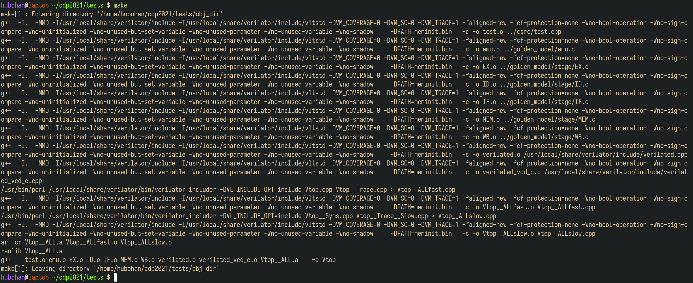
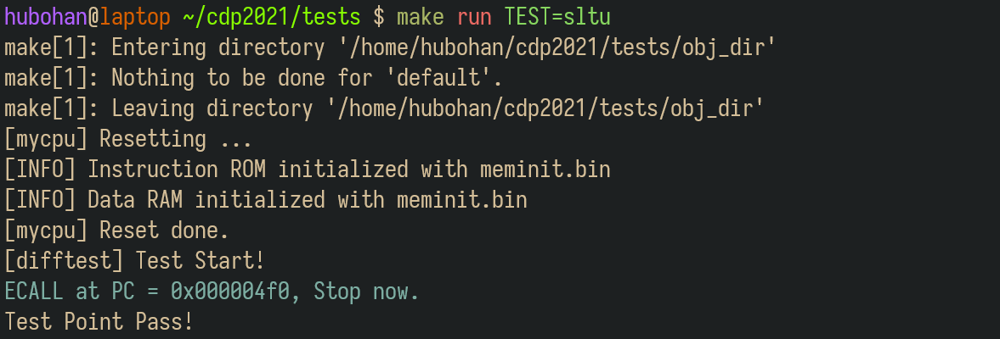
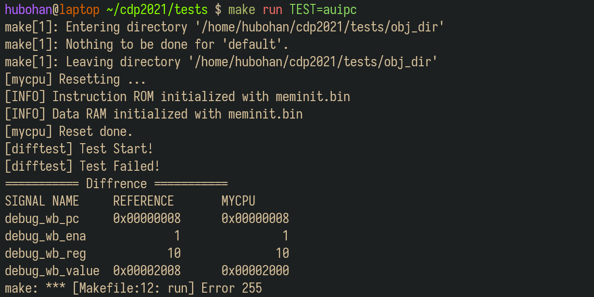
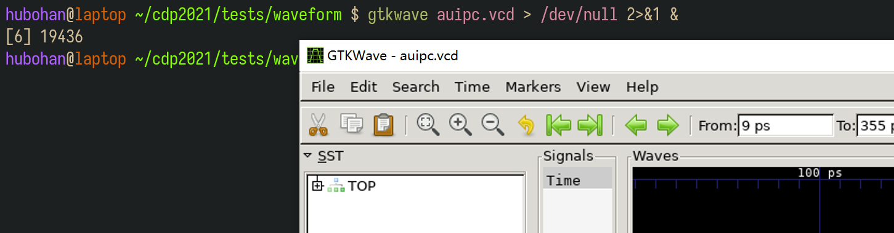
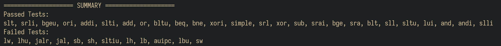

## 1. 关于实验环境

&emsp;&emsp;Trace测试使用Linux系统部署测试环境，我们提供了三种实验环境供同学们选择：

**（1）远程实验平台**

&emsp;&emsp;远程实验平台已经将Trace部署在实验中心的服务器上，我们把所有依赖的配置都已经事先搭建完毕。无论你的电脑性能如何，无论你是在宿舍、实验室还是自习室，只要你还能连上校园网，你就能完成你的实验。具体使用方式详见<a href="../remote_env/" target="_blank">附录1：远程实验环境使用指南</a>。

!!! info 温馨提示
    &emsp;&emsp;虽然我们已经做了一些方案保证远程环境的可靠性，但在某些特殊情况下，也不能确保不出故障，为安全起见，建议同学们将代码及时上传到git仓库或者下载到本地保存。

**（2）本地虚拟机**
  
&emsp;&emsp;我们提供了虚拟机镜像供同学们下载到你本地的电脑上运行。我们也帮你把所有依赖的配置都已经事先搭建完毕，你只需要下载、导入虚拟机即可使用。具体使用方式详见<a href="../vm/" target="_blank">附录2：虚拟机使用指南</a>。

**（3）自行部署实验环境**

&emsp;&emsp;同学们也可以尝试在自己的电脑上部署实验环境，体验一下自己动手的乐趣：）具体搭建方法详见<a href="../env_diy/" target="_blank">附录3：实验环境部署指南</a>。


## 2. 了解测试框架

&emsp;&emsp;请在终端里依次输入并执行下列命令，以拉取测试框架代码：

``` bash linenums="1"
cd ~
git clone https://gitee.com/hitsz-cslab/cdp-tests.git
cd cdp-tests
```

!!! info "关于miniLA :loudspeaker:"
    &emsp;&emsp;实现miniLA指令集的同学，拉取测试框架时，请执行以下命令：

    ``` bash linenums="1"
    cd ~
    git clone -b miniLA https://gitee.com/hitsz-cslab/cdp-tests.git
    cd cdp-tests
    ```

&emsp;&emsp;cdp-tests目录的文件结构如下图所示。

```
.
├── bin（指令测试用例，用于初始化内存）
│   ├── add.bin
│   ├── .......
│   ├── xor.bin
│   └── xori.bin
├── asm（指令测试用例的反汇编文件，用于调试）
│   ├── add.dump
│   ├── .......
│   ├── xor.dump
│   └── xori.dump
├── csrc（测试驱动框架，包括比对逻辑）
│   ├── dut.h
│   └── test.cpp
├── golden_model（参考RISC-V CPU行为模型，使用C语言编写）
│   ├── emu.c
│   ├── include/...
│   └── stage/...
├── waveform【运行测试后生成】（运行测试生成的波形文件，用于调试）
│   ├── add.vcd
│   ├── ........
│   └── xori.vcd
├── Makefile
├── mySoC（你实现的SoC的Verilog代码，放在此目录下，仅放Verilog代码，不拷贝IP核）
|   ├── defines.vh
│   ├── miniRV_SoC.v（或miniLA_SoC.v）
|   ├── myCPU.v
|   ├── Bridge.v
│   └── ......
├── vsrc（仿真需要用到的其他文件）
|   ├── ram.v（distributed memory的行为仿真模型）
│   └── ram1.v（用于字节和半字的Load/Store指令测试）
├── run_all_tests.py（自动化测试脚本）
└── Makefile
```

&emsp;&emsp;测试的原理是差分测试，即比对标准模型和待测模型之间的区别。在实验中，标准模型就是`golden_model`下使用C语言实现的CPU模型，而待测模块就是你所实现的CPU。驱动测试的代码逻辑位于`csrc`文件夹中，分别让标准模型和待测模型执行同一条指令，比对他们执行的结果，来确定你的CPU是否实现正确。**你只需要关注`mySoC`目录，暂时不需要关注其他目录，你需要将自己实现的CPU的Verilog代码粘贴到这个目录下。**


## 3. 添加自己的代码

&emsp;&emsp;`mySoC`目录中包含了你实现的CPU、总线桥以及SoC顶层模块及其对外的连线，你需要将自己实现的整个SoC工程的代码复制到该目录下，模块的层次结构如下图所示：

<center></center>

&emsp;&emsp;需要注意的是：

- 在之前的实验中，我们是使用IP核来实现的指令和数据存储器，而在此处，我们已经为你提供了相应的IP，你无需将IP核的xci文件拷贝至目录下，只需在SoC顶层模块中实例化并完成连线即可。

- **你需要保证在`mySoC`目录下的模块的层次关系中，SoC的顶层模块名叫做`miniRV_SoC`（或`miniLA_SoC`），且顶层模块的接口信号命名满足要求。**

``` Verilog linenums="1"
`include "defines.vh"  // 运行Trace测试时，将此文件的RUN_TRACE取消注释; 下板时，注释RUN_TRACE.
module miniRV_SoC (
    input  wire        fpga_rst,             // High active
    input  wire        fpga_clk,
    ......   // 外设I/O接口信号
`ifdef RUN_TRACE
    ,// Debug Interface
    output wire        debug_wb_have_inst,   // WB阶段是否有指令 (对单周期CPU，可在复位后恒为1)
    output wire [31:0] debug_wb_pc,          // WB阶段的PC (若wb_have_inst=0，此项可为任意值)
    output wire        debug_wb_ena,         // WB阶段的寄存器写使能 (若wb_have_inst=0，此项可为任意值)
    output wire [ 4:0] debug_wb_reg,         // WB阶段写入的寄存器号 (若wb_ena或wb_have_inst=0，此项可为任意值)
    output wire [31:0] debug_wb_value        // WB阶段写入寄存器的值 (若wb_ena或wb_have_inst=0，此项可为任意值)
`endif
);
    ......

    myCPU Core_cpu (
        .cpu_rst     (fpga_rst),
        .cpu_clk     (cpu_clk),
        //......
    );

    // 下面两个模块，只需要实例化代码和连线代码，不需要创建IP核
    IROM Mem_IROM (
        .a      (...),
        .spo    (...)
    );
    
    DRAM Mem_DRAM (
        .clk    (...),
        .a      (...),
        .spo    (...),
        .we     (...),
        .d      (...)
    );

endmodule
```

!!! Warning "Trace注意事项 :mega:"
    &emsp;&emsp;（1）运行Trace前，需将`defines.vh`中的`RUN_TRACE`取消注释！综合/实现/比特流前，将`RUN_TRACE`注释！
    
    &emsp;&emsp;（2）对于Trace比对，需要将指令ROM和数据RAM的大小设置为 **32bit*65536**！

    &emsp;&emsp;（3）指令ROM的模块名必须是 **IROM**，数据RAM的模块名必须是 **DRAM**！
    
    &emsp;&emsp;（4）高电平复位，且CPU复位后执行的首条指令的地址必须是 **0x0000_0000**！  
    
    &emsp;&emsp;**以上设置错误会导致Trace比对失败！**


## 4. 运行测试

!!! tip "注意事项 :loudspeaker:"
    &emsp;&emsp;如果在实现字节、半字的Load/Store指令时，更改了IP核配置或使用了多体存储器，则在使用Trace测试时，需进入到`cdp-tests/vsrc/`目录，将`ram1.v`的代码替换掉`ram.v`的代码。

&emsp;&emsp;推荐使用 **MobaXterm运行测试** （远程实验平台的MobaXterm用法详见<a href="../remote_env/#24-mobaxterm" target="_blank">附录1的2.4节-使用MobaXterm</a>，虚拟机的MobaXterm用法详见<a href="../vm/#4-mobaxterm" target="_blank">附录2的第4节-使用MobaXTerm</a>）。

&emsp;&emsp;首先进入cdp-tests文件夹，输入命令：

``` bash linenums="1"
cd cdp-tests
make
```

&emsp;&emsp;将会编译你的Verilog代码，生成可执行的仿真模型。



### 4.1 运行单个测试

&emsp;&emsp;如果你对你CPU没有充足的信心，你可以选择单个测试运行，所有的测试用例都位于`bin`文件夹下，输入命令

``` bash linenums="1"
ls bin
```

&emsp;&emsp;可以看到测试点名称。

&emsp;&emsp;例如，我们想运行`sltu`指令的测试，我们输入：

``` bash linenums="1"
make run TEST=sltu
```



&emsp;&emsp;打印出Test Point Pass之后，就代表这条指令测试通过了。

&emsp;&emsp;如果发生了错误，就会打印如下所示的信息：



&emsp;&emsp;左栏为参照的正确实现，右栏为你实现的CPU给出的信号，通过比对这两组信号，你可以很快地确定错误发生在哪一条指令执行过程中，然后通过反汇编和波形的形式进行调试。

### 4.2 打开波形

&emsp;&emsp;在执行完某个测试之后，所生成的波形会在`waveform`文件夹中。如果要查看某个测试用例的波形，比如`auipc`，则在终端输入并执行以下命令（实际操作时，将`auipc`替换成需要打开的文件名，比如替换成`add`、`ori`等等）：

``` bash linenums="1"
gtkwave waveform/auipc.vcd > /dev/null 2>&1 &  
```

!!! warning 提示
    &emsp;&emsp;如果你要通过VSCode工具自带的终端查看波形，你需要在你自己的电脑上安装vcxsrv，此外还需要在VSCode安装remote X11插件，安装完成后就可以查看波形了。
    如果你用MobaXterm就不需要那么麻烦，直接输入命令就可以查看波形：）

&emsp;&emsp;弹出波形窗口。



### 4.3 查看反汇编

&emsp;&emsp;反汇编文件在`asm`文件夹中，在上述例子中，我们看到是在PC=8处出现了错误，写回的值不对，而观察`auipc.dump`文件，可以找到出错点。

<center></center>

&emsp;&emsp;根据出错点，结合波形，我们可以进行高效的调试了。

### 4.4 批量运行测试

&emsp;&emsp;如果你对你的实现有足够的信心，可以采用以下两种方式来自动化测试。

**（1）使用python脚本自动测试**

``` bash linenums="1"
python3 run_all_tests.py
```

!!! Warning
    &emsp;&emsp;执行这条命令之前，需要保证之前已经`make`过了。

&emsp;&emsp;在很长的滚屏之后，会出现一个测试报告，告诉你哪些测试通过，哪些测试不通过。所有测试点的波形文件都在`waveform`文件夹中，你可以打开对应的文件结合反汇编和在SUMMARY之前输出的报错信息进行调试。

<center></center>



**（2）使用start测试程序自动测试**

!!! info "关于miniLA :loudspeaker:"
    &emsp;&emsp;miniLA的Trace测试包无此功能，故可略过。

&emsp;&emsp;输入以下命令:

``` bash linenums="1"
make run TEST=start
```

&emsp;&emsp;如果你的mycpu能够支持37条指令（24条必做和13条选做），则会显示“Test Point Pass!”。

<center></center>

&emsp;&emsp;如果测试显示“[difftest] Test Failed!”，说明没有通过37条指令测试。Digiti的数值则表示你的mycpu通过的功能点数，其高8位为0x25，表示共有37个测试点，低8位表示通过的测试点数。

<center></center>

&emsp;&emsp;例如，上图所示的测试结果表面，该CPU通过了0x18，即24条指令的测试。
