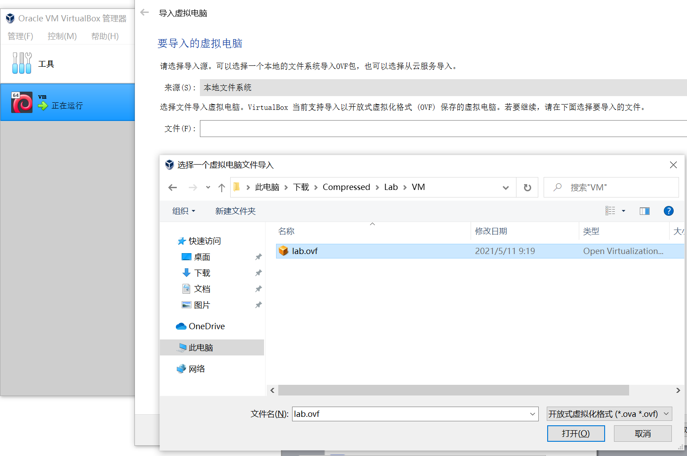
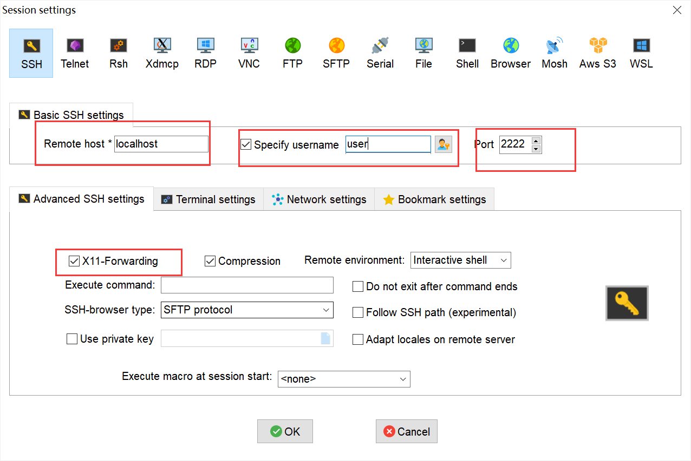
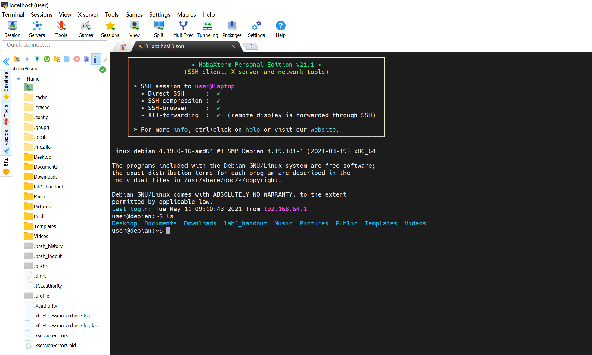

## 1. 下载虚拟机

&emsp;&emsp;测试环境及相关工具下载地址：

- 虚拟机镜像：<a href="https://otuyernchr.feishu.cn/file/boxcnrClUmwkmCZz5JbPsf7QnCb" target="_blank">vm.ova</a>

- MobaXTerm和VirtualBox：<a href="https://otuyernchr.feishu.cn/file/boxcnTjEReejhlrl0DlCte1Lrrf" target="_blank">虚拟机工具.zip</a>

&emsp;&emsp;下载后，请参照本页后的“附录”导入虚拟机。

## 2. 导入虚拟机

&emsp;&emsp;推荐使用VirtualBox。下载完毕后，请在Virtualbox中导入：管理->导入虚拟电脑，选择对应OVF文件。

## 3. 配置虚拟网卡

&emsp;&emsp;VirtualBox中对于虚拟网卡，需要稍微配置一下才可以使用，具体的配置如下：

## 4. 使用MobaXTerm

&emsp;&emsp;为了更好的使用体验，推荐使用MobaXTerm通过ssh连接到本地的虚拟机进行进一步的操作。压缩包里提供了MobaXTerm。

&emsp;&emsp;在MobaXTerm中，点击左上角“会话”。

&emsp;&emsp;在弹出窗口中，点击”SSH“，按如下内容填写（“远程主机”地址需要自己查询）。填写完毕后，点击“好 的”。输入虚拟机密码123456。

&emsp;&emsp;连接完毕之后，虚拟机可最小化到后台，在命令行中进行操作。左侧可以与虚拟机的文件交互（上传、 下载），右侧可以输入命令。

